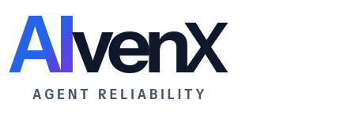
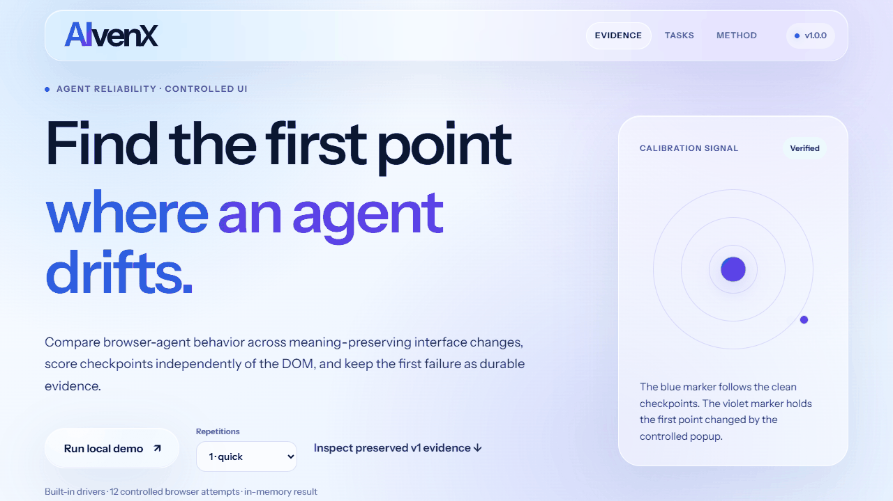

<p align="center">
  
</p>

# Browser Agent Regression

[](https://github.com/AlbertXXuu/BrowserAgentRegression/actions/workflows/ci.yml)

[](LICENSE)

[简体中文](README.zh-CN.md) · [Evidence schema](docs/evidence-schema.md) · [v1 evidence](docs/evidence/v1.0.0-calibration.json)

Browser Agent Regression is a local-first harness for answering one practical question: **did a
browser-agent change improve reliability, or did it quietly break a workflow that used to pass?**

The v1 core provides three resettable browser tasks, four meaning-preserving UI variants,
checkpoint-level independent scoring, repeated baseline/candidate comparison, first-failure
localization, and verifiable JSON evidence. The default demo uses built-in deterministic drivers;
model-backed adapters can apply the same evidence protocol to real-agent experiments.



## Quick start

Python 3.11–3.13 is supported.

```bash
git clone --branch v1.0.0 --depth 1 https://github.com/AlbertXXuu/BrowserAgentRegression.git
cd BrowserAgentRegression

python -m venv .venv
# Windows: .venv\Scripts\activate
# macOS/Linux: source .venv/bin/activate
python -m pip install -e ".[dev]"
python -m playwright install chromium

browser-agent-regression doctor
browser-agent-regression demo
browser-agent-regression studio
```

The demo runs 12 controlled attempts and writes `runs/demo-report.json`. The expected result is clean
parity plus one deliberately induced popup regression for each task, localized to the first failed
checkpoint. The report records a synthetic harness-calibration result with its drivers and protocol.

`studio` opens a loopback visual interface that follows the AlvenX product design language. It starts
from the hash-checked committed evidence and can run the same deterministic calibration in memory
while leaving the committed report unchanged. See [Studio usage](docs/studio.md).

Verify either a new report or the committed v1 evidence:

```bash
browser-agent-regression verify --report runs/demo-report.json
browser-agent-regression verify --report docs/evidence/v1.0.0-calibration.json
```

## What v1 freezes

- CLI commands: `demo`, `oracle`, `calibrate`, `verify`, `doctor`, `serve`, `studio`, and optional
  `deepseek`.
- Task IDs, variant IDs, and ordered checkpoint contracts documented in packaged JSON manifests.
- Evidence schema `1.0`, protocol `browser-agent-regression-controlled-ui-v1`, fixture hashes,
  environment metadata, per-attempt outcomes, summaries, regressions, and first failures.
- Exit codes: `0` for a passing command, `1` for a completed experiment that misses its acceptance
  condition, and `2` for invalid evidence or a runtime/setup failure.

The validator recomputes summaries and regressions from attempts, checks every checkpoint contract,
verifies fixture SHA-256 values against the installed package, and rejects credential-shaped fields.
Historical schema `0.2` reports remain readable and verifiable.

## Built-in experiments

Check the reference driver across all tasks and variants:

```bash
browser-agent-regression oracle --runs 30 --output runs/oracle.json
```

Compare the reference driver with a deliberately popup-blind candidate:

```bash
browser-agent-regression calibrate --runs 10 --output runs/calibration.json
```

Run one task or variant while diagnosing a fixture:

```bash
browser-agent-regression oracle \
  --task catalog.find-and-save.v1 \
  --variant delayed-render \
  --runs 3
```

## Evidence

The committed v1 calibration repeats each baseline/candidate/task/variant cell three times. The
reference and candidate match on clean pages; the candidate falls from 100% to 0% under the popup
overlay for all three tasks, with 100% agreement on each first failed checkpoint. The companion v1
oracle report covers all four variants. Both reports pass the same public `verify` command used in CI.

Earlier Phase 0 evidence is retained as historical provenance, including a one-run Browser Use +
DeepSeek feasibility check. That paid adapter showed integration feasibility but not repeated model
reliability; the independent DOM scorer remains authoritative.

## Optional real agent

The Browser Use + DeepSeek adapter applies the same tasks and independent DOM scoring to a
model-backed run. It can make paid API requests:

```bash
python -m pip install -e ".[agent]"
browser-agent-regression deepseek \
  --task preferences.notifications.v1 \
  --runs 1 \
  --headed
```

Read [the setup and safe-key guide](docs/deepseek.md) first. API credentials are read from the
environment or hidden input and are never written into evidence.

## Project status

v1 stabilizes the harness, CLI, package, and evidence contract for external use. Current work
focuses on setup, evidence readability, and integrations for named agents and models. Use the
controlled workflow for repeatable regression localization, and combine it with WebArena,
BrowserGym, or team evals when broader task coverage is required.

## Development and release checks

```bash
python -m ruff check .
python -m pytest
python scripts/check_repository.py
python -m build
```

Apache-2.0 licensed. Browser Agent Regression is an [AlvenX](https://alvenx.com) open-source
project.
